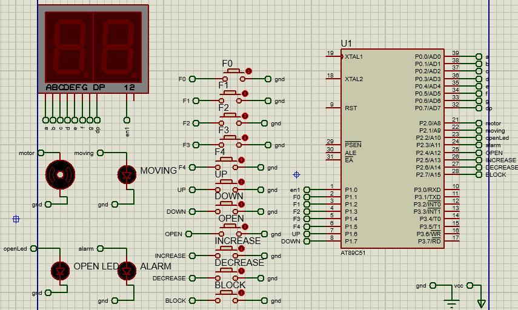
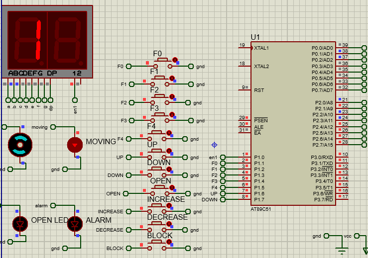

# elevator-embedded-system

    
    

### Brief
> a mimic for existing elevator systems developed in C

### project statement
You are requested to design a simple elevator system with the following requirements:
* The building consists of four floors plus the ground floor.
* Each floor has two buttons to call the elevator, one for going up and another for going
down except in the ground and last floor that requires one button only.
* You should have, at least, five buttons inside the elevator cart, one to select the
desired floor.
* The elevator door waits for 5 seconds before closing the door, while the door can be
kept open by pushing an open button that forces the door to open for 5 seconds.
Also, the elevator door opens if someone blocks the door.
* If the elevator is going up, it should not stop for a “going down” request from any
floor, and vice versa: if it is going down it should not stop for a “going up request”.
* For simplicity, you can assume that a “going up” request goes to the top floor, and a
“going down” request makes the elevator go to the ground floor.
* The elevator system should save the requests, for example if the elevator is going up,
and you pressed on the “going down” button, the elevator shall ignore the request
initially, but when it reaches the top floor it should go back to pick up that one who
wants to go down.
* The maximum load is four persons. If the number of persons exceeds four, an alarm
should be worked and the elevator will not move.
* You can mimic the existing elevator systems
### drivers implemented
* GPIO
* Leds
* Buttons
* seven Segments

### Concepts Covered
* layering Architecture
* embedded C programming
* Polling
* 8051 Gpio Pripheral

### Tools used
* Proteus
* Silicon Labs C8051F020 Kit
* Silicon Labs IDE (limited version)

### Hardware Components

Component | use Case
--------- | ----------
DC Motor | simulating the opening and closing movements of the door
Moving Led | simulating the moving of the elevator
Open Led | the led is ON when the door is Open
Alarm Led | the led is ON when Max persons number are reached
F0 button | for selecting Floor 0 (GND)
F1 button | for selecting Floor 1
F2 button | for selecting Floor 2
F3 button | for selecting Floor 3
F4 button | for selecting Floor 4 (TOP)
UP button | for Requesting the elevator to Go Up to Top floor (according to statement assumption)
DOWN button | for Requesting the elevator to Go Down to GROUND floor (according to statement assumption)
OPEN button | for opening the Door after Closing and Before Moving
INCREASE button | simulating number of persons Entering (persons Number increase by one for each press)
DECREASE button | simulating number of persons leaving (persons Number decrease by one for each press)
BLOCK button | simulating blockage Event while closing the door (only activated while closing the door)
Common Anode Seven segment | for viewing (inside the elevator) which Floor the elevator reached

